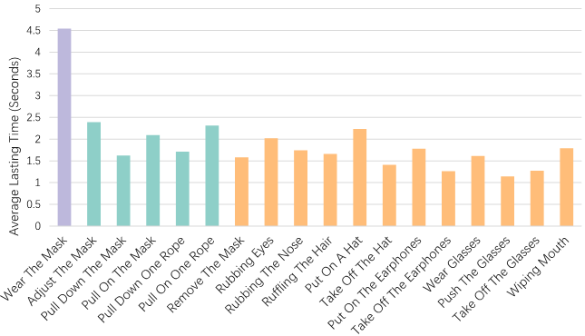

# Mask Wearing Status Estimation with Smartwatches

## Prerequisite

* libsvm
* fvcore
* matplotlib
* numpy
* pandas
* scipy
* seaborn
* torch
* tqdm

## How to run

0. Download datasource from [here](XXX).

1. "git clone" this repository.  

2. Run `./data_prepare.sh`

    Based on different strategy split datasource into training set and testing set.

3. Run `./run.sh`

    Under the same splitting strategy train specific model.

## Dataset

We recruit 20 volunteers, including 7 men and 13 women, to conduct 18 different actions.

Each volunteer repeats each action 20 times:
- Smartwatch on the **left hand**: 10 times
- Smartwatch on the **right hand**: 10 times

We use a Samsung Gear Sport smartwatch to record readings of **accelerometers** and **gyroscopes** with **50Hz**, and corresponding **timestamps**. 

Meanwhile, we use a camera to record video streams and corresponding timestamps to support us label actions.

In all, we have a dataset with 7600 segments of IMU readings. To be specific, **"Adjust The Mask"** contains a combinated actions, so we record this action 40 times(20 times on the left hand and 20 times on the right hand)

$$ volunteers \times actions \times hands \times repeats = 20 \times 17 \times 2 \times 10 \add 20 \times 1 \times 2 \times 20 = 7600$$

### Actions



18 actions are divided into three categories:

- Wearing a mask
    - Wear The Mask
- Mask-wearing related actions
    - Adjust The Mask
    - Pull On The Mask
    - Pull Down The Mask
    - Pull On One Rope
    - Pull Down One Rope
- Actions that may mislead mask-wearing status estimation
    - Remove The Mask
    - Rubbing Eyes
    - Rubbing The Nose
    - Rubbing The Hair
    - Put On A Hat
    - Take Off The Hat
    - Put On The Earphones
    - Take Off The Earphones
    - Wear Glasses
    - Push The Glasses
    - Take Off The Glasses
    - Wiping Mouth

### Description

The folder named `left` stores the data collected from the left hand, and `right` stores the data collected from right hand.

The file name with the format of  "I_J_K.mat".

- **I**(1 - 20): the I-th subject.
- **J**(1 - 18): the J-th action.
- **K**(0 - 9 or 0 - 19): the K-th repetition.

Every mat file contains three keys:
- **accData**(1, 3, sequence length): A sequence of the accelerometer readings.
- **gyrData** (1, 3, sequence length): A sequence of the gyroscope readings.
- **label**(1, sequence length): Action labels for each sample point.

## Citation
```
@article{meng2022mask,
  title={Mask Wearing Status Estimation with Smartwatches},
  author={Meng, Huina and Wu, Xilei and Wang, Xin and Fan, Yuhan and Shi, Jingang and Ding, Han and Wang, Fei},
  journal={arXiv preprint arXiv:2205.06113},
  year={2022}
}
```